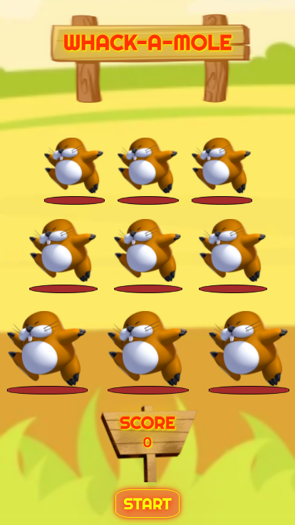
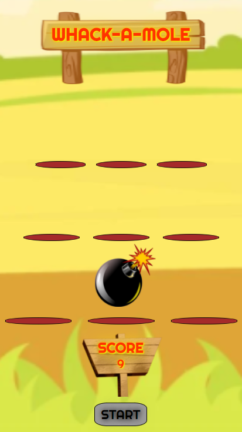
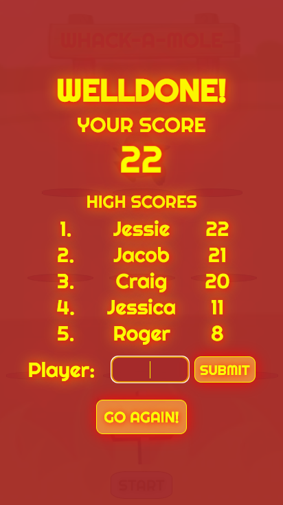

  
# Whack-A-Mole Game
A "whacky" version of Whack-A-Mole with dangerous, bomb-having moles. A single player game which allows for high score saving so you can compete against a friend on the same device by taking turns.

## General Info 
I made this during week 4 of my software development course at _nology. 

This project was very enjoyable for me. I had full control over what features to implement and the styling and I tried to make the most of it. I hope you enjoy playing!

## Technologies used
* Javascript ES6
* HTML 5
* CSS 3/SCSS

## Rules
Whack-A-Mole is fun because it is so simple, yet manic. Just keep whacking those moles! Each hit logs 1 point and these moles don't go down easy so you can get a few hits in before they hide.

* Click the Start Button
* Either a mole or a bomb will pop out of a random hole on a timer. 
* DON'T CLICK THE BOMBS! YOU WILL LOSE 5 POINTS AND THEY EXPLODE!
* Click the moles as many times as possible when they are visible. You get 1 point for each whack.
* Game will finish after 15 seconds.
* A Game Over Screen will pop up after the game timer is out.
* Type your name and click the Submit button. If you have a top 5 score, your name will appear on the leader board!
* Click Go Again if you want to try beeting your score!

## Under the Hood
Firstly, the overall layout. The moles, bombs, explosions are stored within a grid. Each row of the grid is set to a different percentage display width.
I am using position absolute to have the bombs and explosions sit directly where the moles and just alternating their active class to change whether they are visible or not. You can see the HTML below.
````javascript
<main>
    <section class="holes">
      <div class="holes__row__1 holes__row">
        <div class="holes__row__1__1 holes__row__1__area">  
           
                 
          
          <div class="holes__row__1__1__opening holes__row__1__area__opening"></div>
        </div>
````
The images are .pngs and position absolute is being used to place text and score on top.
As for the start button, it is switching between classes to change the styling whether it has been clicked or not.
Once a round of the game has been completed, the class is changing on the Game Over overlay and it becomes visible. Through the use of a form and a 2D array the Highscores can be updated. Using a sort() after the new players name has been put in will arrange the high scores and only display the first 5 indeces. 

````javascript
index.html...

<section class="gameover-display">
    <h2 class="gameover-display__welldone">WELLDONE!</h2>
    <div class="gameover-display__your-score">YOUR SCORE</div>
    <div class="gameover-display__score"></div>
    <div class="gameover-display__highscores">HIGH SCORES</div>
    <div class="gameover-display__highscore-list"></div>
    <form class="gameover-display__player">
      <label for="player">Player:</label>
      <input type="text" id="player" name="player" class="gameover-display__player__input">
      <input type="submit" value="Submit" class="gameover-display__player__submit">
    </form>
    <button class="gameover-display__retry-button">GO AGAIN!</button>
  </section>


main.js...

let topFive = [["xxxx", 0], ["xxxx", 0], ["xxxx", 0], ["xxxx", 0], ["xxxx", 0]];


highScorestopFive.innerHTML = `
<div>1.</div><div>${topFive[0][0]}</div><div>${topFive[0][1]}</div>
<div>2.</div><div>${topFive[1][0]}</div><div>${topFive[1][1]}</div>
<div>3.</div><div>${topFive[2][0]}</div><div>${topFive[2][1]}</div>
<div>4.</div><div>${topFive[3][0]}</div><div>${topFive[3][1]}</div>
<div>5.</div><div>${topFive[4][0]}</div><div>${topFive[4][1]}</div>
`

const updateHighscores = (e) => {
  e.preventDefault();
  topFive[5] = [playerName.value, count];
  topFive = topFive.sort((a , b) => (b[1] - a[1]));
  console.table(topFive);
  highScorestopFive.innerHTML = `
  <div>1.</div><div>${topFive[0][0]}</div><div>${topFive[0][1]}</div>
  <div>2.</div><div>${topFive[1][0]}</div><div>${topFive[1][1]}</div>
  <div>3.</div><div>${topFive[2][0]}</div><div>${topFive[2][1]}</div>
  <div>4.</div><div>${topFive[3][0]}</div><div>${topFive[3][1]}</div>
  <div>5.</div><div>${topFive[4][0]}</div><div>${topFive[4][1]}</div>
  `
}
````

## I won't spoil the rest of the code for you!
## Feel free to jump into the rest of the code to see how I chose to go about making everything happen!